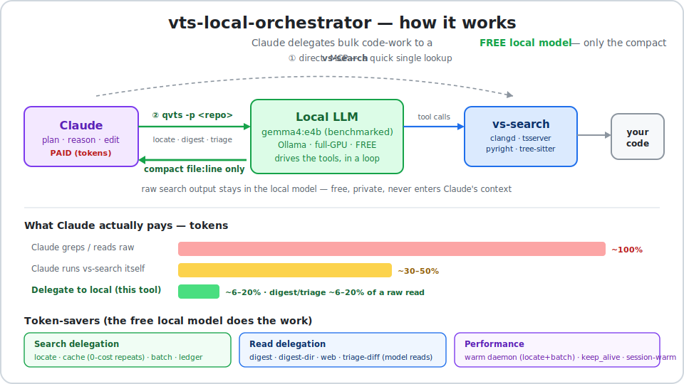

# vts-local-orchestrator

**English** | [한국어](README.ko.md)

**Claude burns expensive tokens reading and grepping your code. This hands that grunt work to a free local
model instead — Claude gets back only the one-line answer.**

<p align="center">
  
</p>

[](https://code.claude.com/docs/en/plugins)
[](https://ollama.com)
[](#is-it-safe)
[](LICENSE)

A companion to **[vs-token-safer](https://github.com/JSungMin/vs-token-safer)**. It runs entirely on your
machine — nothing is uploaded.

## The idea in one line

Finding code — "where are these 20 functions", "who calls X", "what does this file do" — is high-volume,
low-thinking work. A **free local model** can do it. So let it: Claude asks, the local model searches and
reads, and Claude receives just the short answer. The bulky raw output never reaches Claude's context.

**Rule of thumb: "find / count / read" → local model. "decide / design / fix" → Claude.**

You don't run any commands. You just ask Claude the way you always do — with the plugin installed, Claude
quietly hands the search to the local model and shows you the answer:

```text
You      ▸  where is loadConfig defined, and everything that calls it?

Claude   ▸  (hands the search to the local model on your GPU — its raw output never reaches me)
            config-loader.mjs:40       ← defined here
            agent-core.mjs:14,16       ← calls it
            vts-bridge.mjs:29,31       ← calls it

            The local model did the searching. I only spent ~20 tokens reading the answer back.
```

Same for reading: *"what does `tsbridge.py` do — any handlers that spit out a lot?"* → Claude has the local
model read the file and reports back a few lines, instead of pulling the whole file into the conversation.

> Claude decides when to delegate; you never type a command. Prefer driving it yourself? There's a `qvts`
> CLI underneath — see [Quickstart](#quickstart).

## Why you'd want this

- **Cheaper.** The local model is free and runs on your GPU. Claude only pays for the final summary.
- **Private.** The model and the search tools both run on `127.0.0.1`. Your code never leaves the machine.
- **Works with any model.** Default is `gemma4:e4b` (picked by [benchmark](#which-model), not by name) — swap it in one line.

## Quickstart

You need [Ollama](https://ollama.com), **Node 18+**, and a copy of
[vs-token-safer](https://github.com/JSungMin/vs-token-safer) beside this repo.

```bash
git clone <this-repo-url> vts-local-orchestrator && cd vts-local-orchestrator
npm install
bash setup-macos.sh          # macOS/Linux — picks a model for your RAM, builds it, writes the config
#  Windows: setup.ps1  (see DEPLOY.md)
```

Then install it as a Claude Code plugin (or paste [`claude-routing.md`](claude-routing.md) into your
`CLAUDE.md`). **That's it** — now ask Claude normally and it delegates searches and big reads on its own.

Want to watch it happen live? `node dashboard.mjs` → http://127.0.0.1:7878.

<details>
<summary>Driving it yourself (the <code>qvts</code> CLI under the hood)</summary>

You normally never touch this — Claude calls it for you — but it's a plain CLI if you want it:

```bash
qvts -p /path/to/repo "find all callers of createSession"     # ask in plain language
qvts digest ./big-file.md --focus "what does this do?"        # have it read a file for you
qvts --savings                                                # how many tokens you've saved
```
</details>

## What it can do

Just ask Claude in plain language — these all get delegated to the local model:

**Finding code** — you get back `file:line`:
- *"where is `loadConfig` declared?"* · *"who calls `createSession`?"* · *"find every file named `*.test.ts`"*
- *"where are all of these defined: X, Y, Z?"* — many at once, in one pass.

**Reading code** — you get a short brief, not a wall of source:
- *"what does `tsbridge.py` do?"* · *"summarize the `auth` folder"*
- *"what changed in my diff, and which files should I review?"*

**Seeing it work:**
- *"open the dashboard"* — a live local page showing what the model is doing, grouped by project and task
  type, plus how many tokens you've saved.

Repeat questions are instant and free (cached), and every delegation is added to a running savings tally.

## Which model

Any Ollama model with tool-calling works. The default **`gemma4:e4b`** wasn't picked by reputation — on a
16 GB machine it was simply the most accurate at finding code, in one try, and the fastest of the accurate
ones.

<details>
<summary>The benchmark (and how to reproduce / switch models)</summary>

On a **16 GB Apple M4**, every candidate was run through the real `qvts` bridge on search tasks with known
answers across three repos, scored on correctness, reliability, speed (warm), and staying 100% on GPU.

| Model (tuned `-vts`) | size | "where is X declared" | other searches | speed (warm) | GPU / memory | verdict |
| --- | --- | --- | --- | --- | --- | --- |
| **gemma4:e4b** *(default)* | 8 B | ✅ **8/8**, 1 call each | ✅ | **7–12 s** | 100% GPU · ~9.6 GB | **best balance** |
| qwen2.5-coder 14B | 14 B | ✅ 4/4 | ✅ | slow 9–43 s | 100% GPU · ~11 GB (tight) | accurate but slow + heavy |
| qwen3:8b | 8 B | ✅ only with `think` on | ✅ | very slow 23–89 s | 100% GPU · ~6.6 GB | bad speed↔accuracy tradeoff |
| qwen2.5-coder 7B | 7.6 B | ❌ **0/6** (loops) | ✅ files/refs | fast 2–3 s | 100% GPU · ~5.8 GB | fails a core search function |
| gemma3:12b | 12 B | — | — | — | — | **can't tool-call — disqualified** |

The code-specialized qwen2.5-coder 7B (the obvious first guess) reproducibly *fails* "where is X declared" —
it picks the wrong tool and loops — so it's unsafe as the default. Bigger qwen fixes accuracy but is slow and
memory-tight on 16 GB.

**Switch the model:** build a tuned variant and point the config at it.
```bash
ollama create my-vts -f Modelfile.my       # FROM <base> + temperature 0.15 + num_gpu 999
# set "model": "my-vts" in qvts.config.json  (or export QVTS_MODEL=my-vts)
```
The model must list `tools` under `ollama show <model>`. Full method in
[the commit history / ORCHESTRATION.md].
</details>

## How much does it save

Per run, the dashboard shows what Claude *would* have spent three ways:

| Strategy | Roughly |
| --- | --- |
| Claude greps / reads raw | ~100% (baseline) |
| Claude runs the search tools itself | ~30–50% |
| **Delegate to the local model (this tool)** | **~6–20%** |

These are estimates (`≈ chars/4`); the baselines are what you *avoided*, not extra cost.

## How it works (short version)

`vs-token-safer` is a code-search toolset for Claude Code, but Claude can't run it on a *different* model.
This bridges that gap: it starts the search server, hands those tools to your local Ollama model, and lets
the model run the search loop on its own — then returns just the answer to Claude.

The local model only gets **read-only search tools**; all edits stay with Claude. The bridge also cleans up
after small models (fills in the repo path they forget, recovers tool calls from plain text, stops them
looping on a typo).

<details>
<summary>Full reference — every command, flag, and setting</summary>

**Commands:** `qvts "<search>"` · `digest <file>` · `digest-dir <dir>` · `web <url>` · `triage-diff` ·
`daemon start|stop|status` · `--savings`
**Flags:** `--json` · `-p/--project <repo>` · `--no-cache` · `--no-daemon` · `--batch <json|file|->` ·
`--focus "..."` · `--staged`

Settings merge low→high: built-in defaults < `qvts.config.json` < `VTS_*`/`QVTS_*` env vars.

| Config key | Env var | Default | Meaning |
| --- | --- | --- | --- |
| `model` | `QVTS_MODEL` | `gemma4-vts` | Ollama model to drive (must have `tools`). |
| `numCtx` | `QVTS_NUM_CTX` | `16384` | Context window. |
| `maxSteps` | `QVTS_MAXSTEPS` | `25` | Tool-call rounds before giving up. |
| `vtsServer` | `VTS_SERVER` | auto | Path to `vs-token-safer/server/index.js`. |
| `project` | `VTS_PROJECT` | from vs-token-safer | Target repo (override per call with `-p`). |
| `port` | `PORT` | `7878` | Dashboard port. |
| — | `QVTS_THINK` | unset | `0` = fast tool-driving; `1` = on; unset = model default. |
| — | `QVTS_AUTO_NARROW` | `soft` | On an unindexed C/C++ tree: `soft` fast-fail · `hard` drop · `off`. |
| — | `QVTS_DEF_SEARCH` | on | `0` disables the language-aware declaration finder. |
| — | `VTS_AUTO_DAEMON` | off | `1` = auto-start the warm daemon for the session's repo. |
| — | `VTS_AUTO_DISTILL` | off | Steer a large `Read` toward `qvts digest`: `warn` · `block` · off. |
| — | `QVTS_ACTIVITY_LOG` | on | `0` disables the dashboard activity log. |
| — | `QVTS_CACHE_TTL` | `3600` | Cache lifetime (s) for a non-git target. |
| — | `QVTS_KEEP_ALIVE` | `30m` | How long Ollama keeps the model loaded. |
| `ollamaHost` | `OLLAMA_HOST` | `http://127.0.0.1:11434` | Ollama address. |

More: `USAGE.md` · `DEPLOY.md` · `ORCHESTRATION.md` · `claude-routing.md`.
</details>

<details>
<summary>Something not working?</summary>

| Symptom | Fix |
| --- | --- |
| First query takes ~90 s | Cold model load (one-time). `keep_alive` keeps it warm after. |
| `ollama ps` shows CPU offload | Model too big for your VRAM — use a smaller one, or rebuild with `num_gpu 999`. On 16 GB prefer a 7–8B model. |
| `could not resolve @modelcontextprotocol/sdk` | Run `npm install` (the plugin self-heals on first run, or use `/qvts-deps`). |
| "no match" on a symbol you know exists | Small model picked the wrong tool — retry, or let Claude search directly. |
| Wrong repo searched | Always pass `-p <repo-root>`. |
</details>

## Is it safe

Yes — it's local-only. Ollama, the search server, and the dashboard all bind `127.0.0.1`; nothing is
uploaded. The only outbound action is the first-run `npm install`. The local model can only *read* your code;
every edit goes through Claude. (`qvts web <url>` is the one exception — it fetches a page you name.)

## Related

- **[vs-token-safer](https://github.com/JSungMin/vs-token-safer)** — the code-search layer this drives. Required.

## License

MIT © 2026 JSungMin
